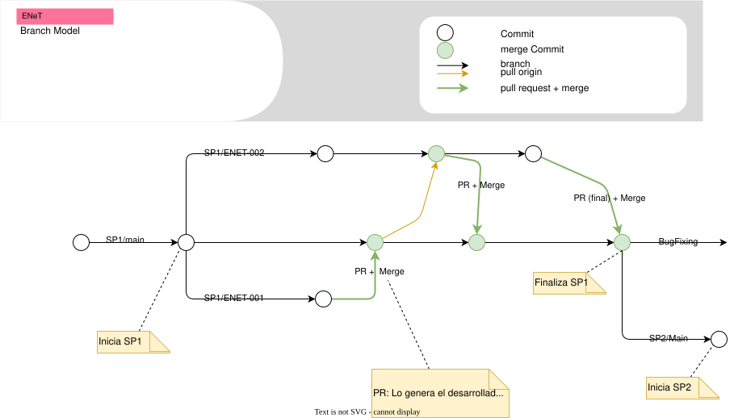

# ENet

## Proyecto

- Implementación del campañas en Mktcloud + Loyalty Management

>ref  <https://www.salesforce.com/marketing/loyalty-management/>

## Branch Model

- Cada sprint tiene su propio branch principal llamado: **SP[x]/main**
  - Ejemplo el sprint 1 es: **SP1/main**
- Cada __desarrollador__ desde el head (último commit) del branch main del sprint correspondiente genera un nuevo branch con el nombre **SP[x]/ENET-[nro]**
  - Ejemplo el sprint 1, la  historia de usuario US-001: **SP1/ENET-001**
- Al finalizar el desarrollo de la historia de usuario el __desarrollador__ hará un PR (pull request) desde la rama de desarrollo a la rama main
  - Desde **/SP[x]/ENET-[nro]** hacia **SP[x]/main**
    - Ejemplo el sprint 1, la  historia de usuario ENET-001: **SP1/ENET-001** hacia **SP1/main**
- __Devops__ verifica, actualiza el/los manifiesto/s  y mergea la rama

